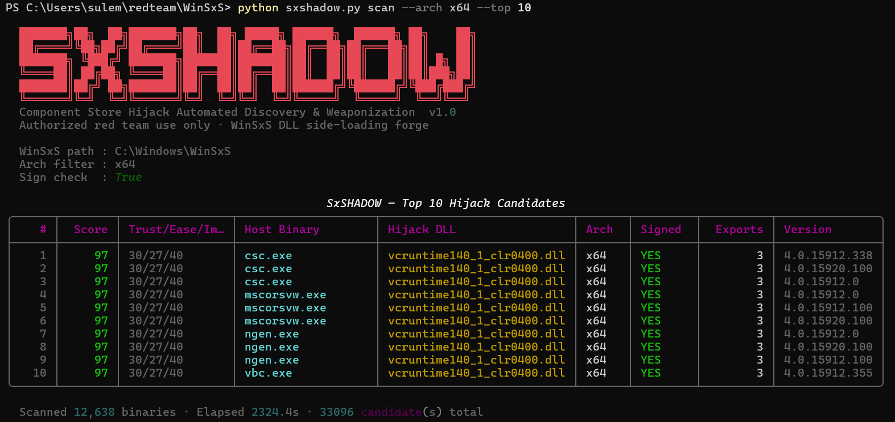
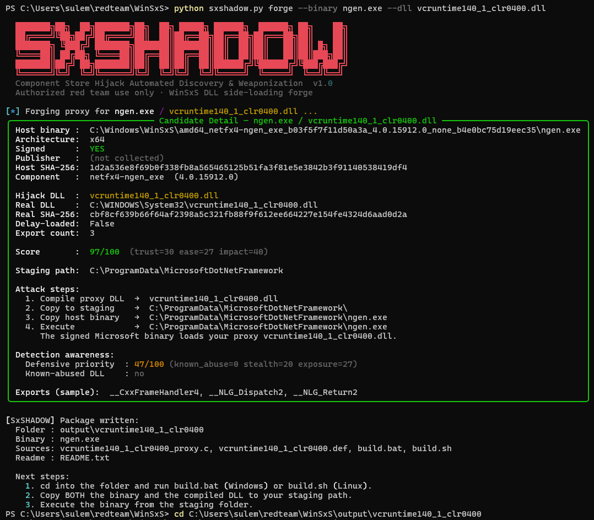
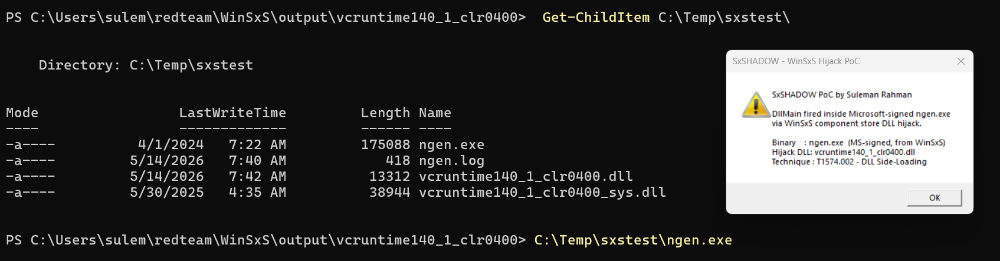

<div align="center">

# SxSHADOW

**Component Store Hijack — Automated Discovery & Weaponization**

Walk every binary in `C:\Windows\WinSxS`, score every DLL hijack candidate,
and forge a ready-to-build proxy DLL — in one command.

[](LICENSE)
[](https://www.python.org/)
[](https://www.microsoft.com/windows/)
[](https://attack.mitre.org/techniques/T1574/002/)
[]()

<br>



</div>

---

## Overview

`C:\Windows\WinSxS` — the **Windows Component Store** — ships with thousands of
Microsoft-signed binary versions placed there by `TrustedInstaller`. Every one
of them follows standard DLL search order. Copy any one to an
operator-controlled folder alongside a crafted proxy DLL, and Windows loads
your code inside a cryptographically-signed Microsoft process.

No UAC prompt. No unsigned binary on disk. No suspicious parent process.

**SxSHADOW** is the first end-to-end automation of that workflow: it walks the
entire Component Store via static PE import-table parsing (zero execution),
eliminates false positives with KnownDLLs / API-set / SxS manifest filters,
ranks every candidate on a composite trust / ease / impact score, and emits
ready-to-build proxy DLL source — together with Sigma rules and SIEM-ready CSVs
for the defenders.

> **MITRE ATT&CK** — [T1574.002 · Hijack Execution Flow: DLL Side-Loading](https://attack.mitre.org/techniques/T1574/002/)

---

## Features

- **Static PE import analysis** — no execution, no privileges required
- **Parallel walker** — every binary in WinSxS in seconds (8 workers by default)
- **Real filtering** — KnownDLLs registry + API-set namespace + SxS manifest binding eliminate the false positives every other tool produces
- **Composite scoring (0–100)** — trust / ease / impact weighting, with full breakdown per candidate
- **Defensive priority axis (0–100)** — independent score reflecting how likely a SOC is to *miss* each hijack
- **Auto-generated proxy DLL** — C source + DEF export file + MSVC `cl.exe` and MinGW `x86_64-w64-mingw32-gcc` build scripts
- **Multiple payload modes** — stub, raw shellcode loader, EXE dropper, secondary DLL loader
- **Blue-team output** — Sigma detection rules, SIEM-ready CSV with full T1574.002 mapping, baseline-integrity CSV
- **Rich console UI** — color tables, per-candidate detail panels, JSON + HTML exports

---

## Installation

```powershell
git clone https://github.com/x0verFl0w/SxSHADOW.git
cd SxSHADOW
pip install -r requirements.txt
```

Or as an editable package:

```powershell
pip install -e .
```

**Requirements**

| Item     | Version              | Notes                                    |
|----------|----------------------|------------------------------------------|
| Python   | 3.8+                 | tested on 3.10 / 3.11 / 3.12             |
| OS       | Windows              | `WinSxS` does not exist on other platforms |
| pefile   | `>= 2023.2.7`        | static PE parsing                        |
| rich     | `>= 13.0.0`          | console rendering                        |
| jinja2   | `>= 3.1.0`           | proxy source + HTML report templates     |

Authenticode signature checks use the in-box PowerShell cmdlet
`Get-AuthenticodeSignature` — no third-party signing libraries required.

---

## Usage

SxSHADOW has three sub-commands: `scan`, `forge`, and `auto`.

### `scan` — enumerate hijack candidates

```powershell
python sxshadow.py scan --arch x64 --top 10
```

Save full output for later triage:

```powershell
python sxshadow.py scan --arch x64 --json results.json --html report.html
```

Emit blue-team detections from the same scan:

```powershell
python sxshadow.py scan --arch x64 `
    --sigma rules.yml `
    --csv detections.csv `
    --baseline-csv baseline.csv
```

A scan against a stock Windows install surfaces tens of thousands of
candidates — ranked, filtered, and ready for triage:

<p align="center">
  
</p>

**Key flags**

| Flag                       | Description                                           |
|----------------------------|-------------------------------------------------------|
| `--arch {x64,x86}`         | Filter by architecture (default: both)                |
| `--top N`                  | Show top-N candidates in console (default: 20)        |
| `--max N`                  | Cap total candidates returned                         |
| `--workers N`              | Parallel PE-parsing threads (default: 8)              |
| `--no-sign-check`          | Skip Authenticode (faster, less accurate trust score) |
| `--no-dlls`                | Only consider EXE hosts (skip DLLs)                   |
| `--no-hashes`              | Skip SHA-256 (faster, no baseline value)              |
| `--detail N`               | Print full panel for candidate #N                     |
| `--json / --html FILE`     | Save full results                                     |
| `--sigma FILE`             | Emit Sigma rules (image_load + process_create)        |
| `--csv FILE`               | SIEM-ready CSV with T1574.002 mapping                 |
| `--baseline-csv FILE`      | "Known-good" snapshot for FIM                         |

### `forge` — build a proxy DLL for a specific pair

```powershell
python sxshadow.py forge --binary ngen.exe --dll vcruntime140_1_clr0400.dll
```

With a real payload:

```powershell
python sxshadow.py forge --binary ngen.exe --dll vcruntime140_1_clr0400.dll `
    --payload-type shellcode `
    --payload sc.bin
```

Forge prints a full candidate-detail panel — host binary path, architecture,
Authenticode status, host + DLL SHA-256, score breakdown, suggested staging
path, attack steps, and defensive-priority awareness — then writes the
complete proxy bundle to disk:

<p align="center">
  
</p>

The output bundle (`output/<dll-stem>/`) contains:

```
proxy.c              proxy DLL source with all exports forwarded
<dll>.def            export DEF file
build.bat            MSVC build (cl.exe)
build.sh             MinGW build (x86_64-w64-mingw32-gcc)
README.txt           operator notes + attack steps + staging path
```

### `auto` — scan + forge the top candidate in one shot

```powershell
python sxshadow.py auto --arch x64
```

With shellcode payload:

```powershell
python sxshadow.py auto --arch x64 --payload-type shellcode --payload sc.bin
```

---

## Proof of Concept

End-to-end demonstration against the top scoring candidate
(`ngen.exe` + `vcruntime140_1_clr0400.dll`, score **97/100**):

1. `scan` ranks `ngen.exe` / `vcruntime140_1_clr0400.dll` first.
2. `forge` emits a proxy DLL that forwards all 3 real exports and fires
   `DllMain` on load.
3. The compiled proxy + a copy of the signed `ngen.exe` are staged side by
   side in an operator-controlled directory.
4. Executing the Microsoft-signed `ngen.exe` from that directory loads the
   proxy via standard DLL search order — `DllMain` runs inside the
   Authenticode-signed process:

<p align="center">
  
</p>

The process tree shows `ngen.exe` (Microsoft-signed, from WinSxS).
The image-load record shows `vcruntime140_1_clr0400.dll` (operator-controlled).
The signed binary is doing exactly what it was designed to do — load its
declared imports from the working directory. **MITRE T1574.002** in one screen.

---

## Project Structure

```
sxshadow.py             entry point + CLI argument parser
wraith.py               legacy alias (back-compat shim)
setup.py                package metadata + console-script entry
requirements.txt        pinned runtime dependencies

core/
  __init__.py           shared dataclasses (ExportEntry, HijackCandidate, ScanResult)
  scanner.py            WinSxS walker + parallel PE parsing pipeline
  pe_parser.py          PE import/export table parser, SHA-256, publisher resolution
  manifest.py           SxS assembly manifest parser (eliminates manifest-bound imports)
  resolver.py           DLL search order + KnownDLLs + API-set filter
  scorer.py             composite trust/ease/impact + defensive-priority scoring
  hijacklibs.py         known-abused-DLL database

forge/
  __init__.py
  proxy_gen.py          proxy DLL C source + DEF + build script generator
  templates/            Jinja2 templates for proxy_dll.c, proxy.def, build.bat

output/
  __init__.py
  reporter.py           Rich console tables + detail panels + JSON / HTML
  packager.py           bundles proxy source + host binary + staging README
  sigma.py              Sigma detection-rule emitter
  csv_export.py         SIEM CSV + baseline integrity CSV

docs/
  images/               README screenshots
```

---

## Blue Team Output

SxSHADOW is symmetric by design — the same scan that finds the attack path
produces the detection artifacts the SOC needs:

| Output            | Flag                | Contents                                                                              |
|-------------------|---------------------|---------------------------------------------------------------------------------------|
| Sigma rules       | `--sigma FILE`      | `image_load` + `process_create` rules per high-priority candidate, tagged T1574.002   |
| SIEM CSV          | `--csv FILE`        | Per (binary, DLL) pair: host SHA-256, expected DLL path + hash, publisher, ATT&CK ID  |
| Baseline CSV      | `--baseline-csv F`  | "Known-good" snapshot for file-integrity monitoring                                   |

The `defensive_priority` field tells you which candidates a SOC is *least*
likely to catch under current EDR coverage of well-known LOLBins. Those are
the ones worth writing rules for first.

---

## MITRE ATT&CK Mapping

| Technique  | Name                                             |
|------------|--------------------------------------------------|
| T1574.002  | Hijack Execution Flow: DLL Side-Loading          |
| T1218      | System Binary Proxy Execution *(related)*        |
| T1036.005  | Masquerading: Match Legitimate Name or Location  |

---

## Authorized Use Only

This tool is published for **security research, authorized red team
engagements, and detection engineering**. The technique it automates is
well-documented in public threat-intel reporting and the MITRE ATT&CK
framework; SxSHADOW does not create a new capability — it accelerates work
that practitioners already perform manually.

**Do not use this tool against any system you do not own or do not have
explicit written authorization to test.** The author accepts no liability for
misuse.

---

## License

Released under the [MIT License](LICENSE).

---

## Author

**Suleman Rahman**
Personal research project — `SxSHADOW v1.0`.

Found a bug, want to contribute a detection rule, or have feedback? Open an
issue or pull request.
